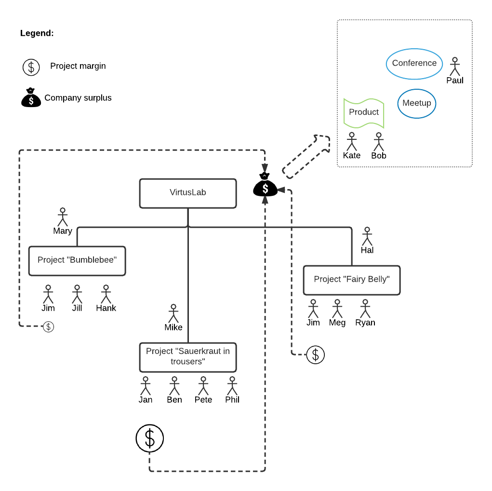
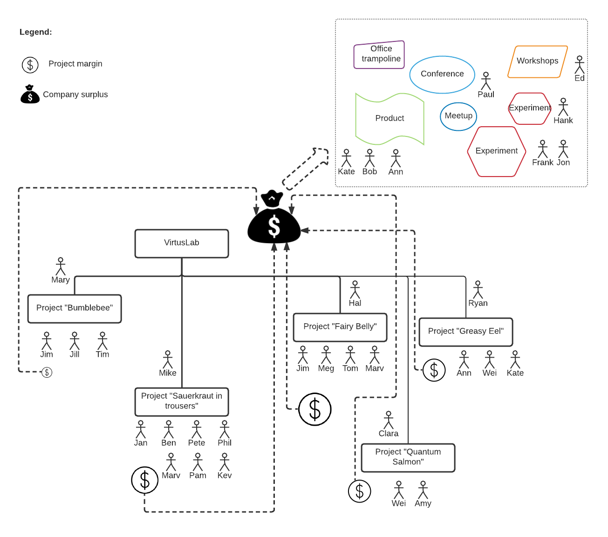
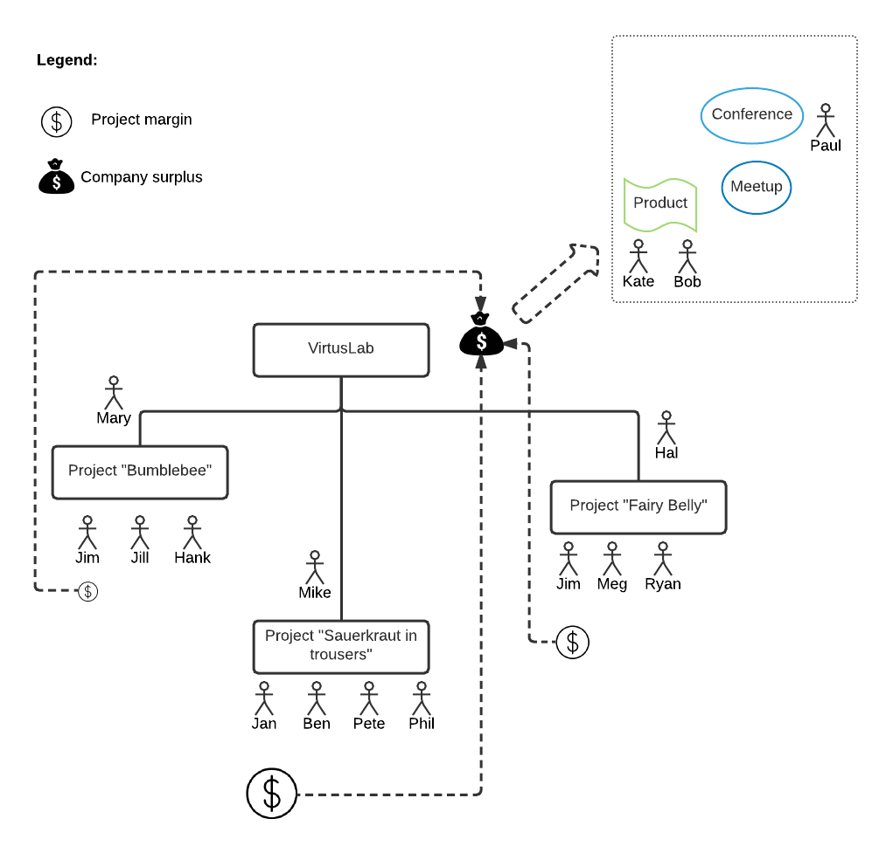
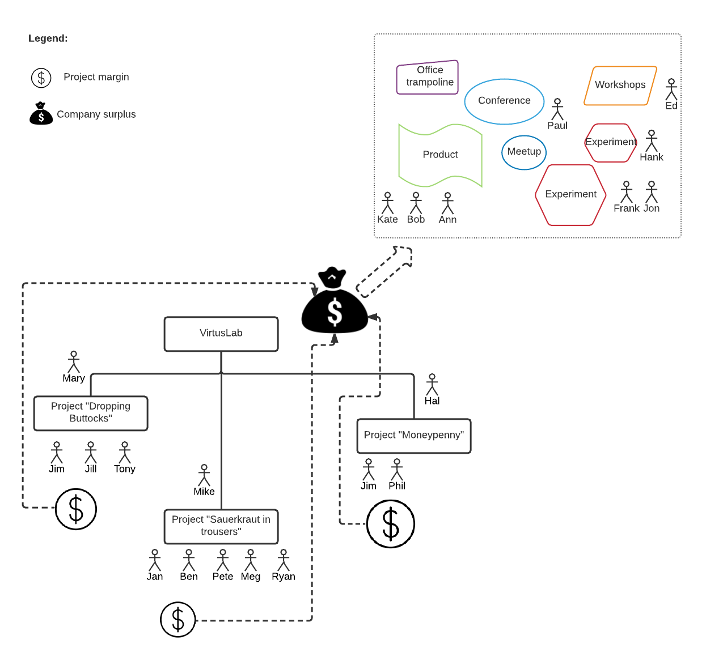

# Spirit

Before we can outline the overall business model it would be useful to have a clear definition of what is our company's spirit and what are the overall values and mission. Granted - these are risky words. Often mission statement or company values are not very far from BS phrases hang on corporate offices, embroiled in gold plating and incidentally not having much to do with the actual, everyday work. "Integrity, Communication, Respect, Excellence". Do you know which company had these values supposedly at its core? Enron had. And we all know it had very little to do with the company everyday ethics. 

So what do we have instead then? A common sense guideline of what we want to be as a company, as a group of individuals. 

Lets start with the simple fact of life. *We need to work.* On the very surface it seems to fulfill straightforward material reasons - we need money to live and to sustain our families. On the deeper level though most of us seek fulfillment through the effects of our work. As professionals or craftsmen we are often happy because of our creations and other people valuing our expertise and contributions. This itself sheds some light on our directions:

1) To deliver the highest quality services to our customers, help them achieve goals and bring real value. We would like to be recognized in the industry as a company that can be relied upon and can undertake complex projects. 

2) To be recognized in the community as experts in our particular domains and in software engineering in general. 

Common sense, right?

If you think about it, this overall guideline directly implies many of the values. Like, if you want to have satisfied customers that would return to us or recommend our work to others (1) it would help if we wouldn't lie or spread misinformation, would be great communicators, show respect and listen to customers opinion and behave and act professionally, delivering high-quality solutions.

If we want to be recognized as industry experts (2) we should probably concentrate not only on acquiring knowledge and expertise but also on giving back - by participating in community events or organizing them, by sharing knowledge (with use of blogs, articles, books and whatnot) and contributing to open source.

As you will see starting from these two goals everything else can be derived (how we grow, what characteristics or skills we value, how you get promotion and who should we hire). 

# Company business model

In its essence VirtusLab is *mostly* a software service company. Mostly - because proprietary products that we develop are by far the minority of overall company activity. Service oriented nature of the company directly indicate types of projects that we are involved with. These are (among others):

* Development services - usually related to planning, designing, developing, testing or deploying particular functions or products according to customer's needs. These may be done completely on our side (when customer is only signing off our work) but usually it is a work done in tandem with engineers / business personas on customer's side. These are usually undertakings done as time & material contracts where we work in rapid, quick feedback loop cycles (iterations) to deliver best value we can to our clients. Fixed-price contracts, where there is specific deadline, functionality and price, may still happen but it's rather rare these days.

* Technology training services - helping our customers to get a solid grasp of particular technology. Performed under umbrella of Virtusity brand, usually concentrated around Lightbend technologies.

* Consulting services - where some of the most experienced engineers on our side help our customers to figure out the best way to solve a given customer's problem, usually by advising specific architecture, approach or technology.

It would be interesting to think about how we could grow with these types undertakings in mind. However, before we go to that point, let us ponder for a moment upon the need of growth.

# Why grow

Growth is kind of overused these days. There is a general mindset that all companies need to grow indefinitely. It would seem this mostly happens due to financial market expectations - either in small scale - with round of investors expecting 10x return on their money - or in larger scale - due to constant growth expectations for companies traded on stock exchanges. 

For privately funded, bootstrapped company like VirtusLab growth however is not an end in itself - rather it is only a means to an end. There is fundamentally nothing wrong with stable, not-growing company that fulfills the needs of customers in certain niche or region, allowing all participating individuals to have an engaging job and solid salary. 

We believe there is a certain stage at which more possibilities become available though. Corollary to this, there is also certain stage that comes with the growth, at which some things become more and more difficult - things like fostering creativity, straightforward communication or coordination of different company-wide activities. However, somewhere between small company consisting of handful individuals and couple-thousands people corporate behemoth there is a range that we believe can struck the balance between company that is still nimble & versatile and at the same time not swamped by corporate guidelines & politics. **We believe this range is still ahead of us.**
antation, open source contributions). In reality it is usuallly spent on some combination of mentioned activities.

Certain company size helps to deal with higher-profile projects or customers (e.g. in financial markets or international companies). It also allows to conduct initiatives that are more involved and money intensive. This can be an internal product or larger conference or interesting proof of concept done in emerging technology / business area. It is worth to emphasize that this last - *experimentation* - is very important. Experimentation is by nature cost-intensive - nearly by definition some number of experiments would not take off and would need to be written off entirely as costs. On the other hand it is crucial for company growth - otherwise company will never explore new markets or technological niches. "The biggest risk is not taking any risk... In a world that changing really quickly, the only strategy that is guaranteed to fail is not taking risks." as Mark Zuckerberg stated once. This experimentations and attempts may range from trying out new technology or methods or even attempting to enter new markets.

But growth is not only headcount increase. The other aspect of growth is a delivered value increase. That is delivering services of a higher value to customers and thus priced with premium. This growth type is equally (if not more) important that headcount growth because it does not require more people (organization growth brings its own problems). It requires however people who are more skilled and experienced. This kind of growth maps into higher company income per employee. This income may be directly used for salary increases or number of available employee benefits. It also could be used for spending some part of our work on interesting activities that do not bring money (or do not bring money just *now* - like trainings, experimentation, open source contributions). In reality it is usually spent on some combination of mentioned activities.

# How our company grows

The two types of growth were already briefly mentioned in the previous section. Let us elaborate on them a little bit further now.

1) Growth by headcount increase - growth in the number of people in the organization. This type of growth is the more straightforward one - as we perform more and more successful projects and leave a trail of happy customers willing to make a repeated business with us over and over again, we grow in size. As number of experienced people increase we can do more projects or projects of a larger scale. We can also have more complete offering - say instead of performing our typical backend engineering, we can also cover e.g. frontend, devops or mobile parts of projects we deliver (assuming that we grow into these directions, which we do).

   One of the downsides of this type of growth is that its nature is the increase in number of people involved which directly implies organizational challenges. Things like communication problems, multi-level chain of command or productivity swamped under the heavy layer of rules and policies are real issues. One way of avoid being devoured by such a grim corporate spirit is to double down on individual / team autonomy and responsibility, on building the structure of loosely coupled teams that are on one hand highly aligned and on the other hand, can take lots of decisions locally, without escalating or waiting for approval. More on this in section: [What skills and culture do we need to cultivate to grow link](#what-skills-and-culture-do-we-need-to-cultivate-to-grow)

   On the upside part - this type of growth is usually more stable, especially in case of some random or unforeseen events. For instance we would still be able to operate even if some number of customers decide to cut down some projects - with more projects in the portfolio we would be able to sustain this situation or even scatter colleagues from cut projects among other ongoing initiatives without too much of a stretch. Running larger number of projects with typical market prices is also more resilient in terms of economic downturns - when many companies resign from premium services. On the downside however managing organization composed of more people brings its own challenges like mentioned communication.

antation, open source contributions). In reality it is usuallly spent on some combination of mentioned activities.

2) Growth by value delivered increase - growth that could be also seen as the increase of income per employee. We do not increase the our company size in terms of employees but instead we undertake more specialized or premium projects.
There is less emphasize on extending team which is easier to manage. Premium projects are often the ones that are more interesting or challenging thus bringing more potential for learning and sharing the knowledge with the community. Equally important - in a straightforward way this type of growth influences salaries of everyone involved - as people are more skilled and participate in more high-profile projects, their salary increases in tandem. 

   On the downside part gaining specialized expertise is usually lengthy process and requires much effort related to sharing knowledge, speaking at conferences and generally weighing-in into community initiatives (e.g. open source) - everything that would help the company and all of us be perceived as experts in a field. Last but not least - premium services are usually the first one to cut in uncertain economic conditions.

As you can see these two types of growth are tradeoffs with to some extent opposite pros/cons characterics. In reality we pursue both types of growth, perhaps putting more emphasize on one of them at certain stages or market conditions. 

Let's seem how this growth scenarios look like in more details now.

## How does growth by headcount increase looks like

Let's imagine the situation like on the picture below.

We have here a situation with 3 projects being run simultaneously at our company. Each of these projects on top of paying salary and other expenditures for all involved brings some margin. Some projects bring better margin than the others (e.g. project "Fairy Belly" brings higher margin than "Bumblebee" despite identical number of folks involved). So in this initial situation our company is able to run couple of side initiatives thanks to overall surplus brought from all the 3 projects - mainly put Kate and Bob to work on our internal product (e.g. Lemma) and organize one or two meetups or conferences. 

After few months of a successful run in this setup and happy customers we may be able to expand a little.

As you see some projects remained as they were (e.g. "Bumblebee") but some grew significantly (e.g. "Sauerkraut in trousers" had 5 folks involved, now there is total of 8 folks involved). Even more - we managed to initiate 2 new projects ("Quantum Salmon" & "Greasy Eel"). 

As you can see thanks to either larger size of existing projects or initiating new projects we could increase company surplus significantly. As you can see we could have 3 folks working on our product, organize bigger conference, run 3 different experimentations at the same time, initiate workshops and even buy trampoline to the office (or perhaps Star Wars / Star Trek imponderabilia to decorate our office). 

If you look closer at all the rearrangement that needed to happen you would see that we needed to hire lots of new colleagues to achieve this growth. In particular Ryan moved from "Fairy Belly" project and become Team Lead in "Greasy Eel" project. We hired Clara to help us run "Quantum Salmon" project. Also Hank moved from "Bumblebee" project to work on one of experiments and Tim joined the project instead. 

## How does growth by value delivered looks like

Again let's start with the same situation as before. As reminder picture below.

Now, this time instead of extending existing projects we did something else.

If you look closely you will notice an interesting thing - mostly the headcount did not change that much comparing to previous example. We still grew people-wise but we also cut "Bumblebee" and "Fairy Belly" projects. They were bringing average margins into company surplus - perhaps they were related to technologies, problems or skills that are widely available on the market, therefore are not rewarded with premium. Instead we initiated 2 other projects - "Dropping Buttocks" and "Moneypenny". Both of them are bringing visibly higher margins - perhaps they are related to technologies or skills that are considered niche or not yet widely available on the market. Or maybe they are just more complex and higher-profile than the ones we had before. 

One way or the other - we managed to grew here to much extent in a different way than the one depicted in ##How does growth by headcount increase look like. That said, we still are able to channel more resources into other initiatives consisting of our product, conference, meetups or experimentation. 

# What skills and culture do we need to cultivate to grow

So in other words - what skills, values and characteristic should we cultivate in order to grow in any of these two ways? Or what should we look into while recruiting new colleagues to join us? Looking through the perspective of the outlined growth model this probably becomes clear. 

We basically should find engineers with potential of growth in one or both of following fields:

1) Leadership and organization. People that are willing to take initiative, decisions, responsibility - future team leaders. Engineers that on one hand are technical enough to understand the intricacies of the complex problems we often need to deal with. At the same time, individuals who are willing to help other people grow and become future leaders. 

2) Highly technical people that are not only able to dig deep into technology but also understand the overall technological landscape. People that can become experts in given field and share this knowledge with colleagues inside company (internal sessions, workshops, mentoring) and outside (e.g. by speaking at conferences, writing blog posts, books or participating or leading open source initiatives). People who can confidently talk with high-level director from high-profile company and explain broad technological choices and decisions that were made in a given project.

These two characteristics form the overall dichotomy in our company progression model. To put it bluntly - skills and achievements in above broad directions are the things that brings you promotion. 

Apart from the target directions outlined above there are many skills and characteristics that are required in both of these cases: 

* To be able to grow without overly rigid, corporate rules we need people who can act on their own - without constant guidance. 

* People who are self-aware, self-disciplined, people who do not need to be told what to do. 

* People with ideas. 

* People who, when they see something broken or missing in our company life, are willing to step out of their role and fix what needs to be fixed. 

* People who can be proactive, not reactive. 

* People who are responsible. 
