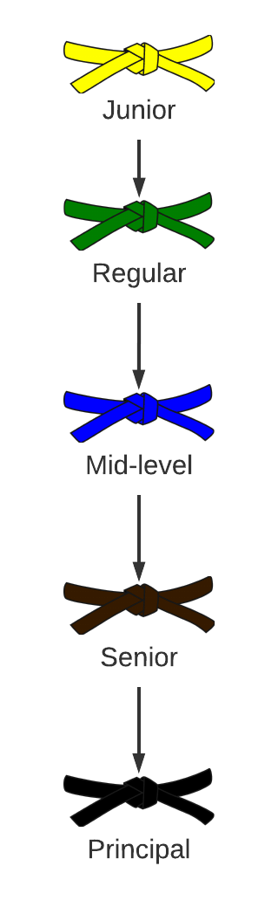

# Engineering progression

In VirtusLab we have several levels of progression for engineering positions. This serves double purpose.

#### Gives a clear guideline for career progression

Clear progression is useful both for all employees and folks outside of company considering joining us. **It's worth to mention however that - as most of things in this handbook - it's descriptive, not prescriptive.** We have folks who advanced much faster on the progression levels than their years of experience would indicate. In contrast, we often have engineers applicating with long experience (indicating senior positions) who we would assign to _regular_ role. This often happens for folks we perceive as _an expert beginners_ ([as wonderfully depicted by Erik Dietrich](https://www.daedtech.com/how-developers-stop-learning-rise-of-the-expert-beginner/)). Another interesting question that emphasizes this phenomenon is the following question: "Have you got 5 years of experience or one year repeated 5 times?".

We would like to believe that we are mostly driven by meritocracy standards. Your contributions matter, not the length of your CV.

#### Provides transparency 

Whereas we do not have full transparency for all the salaries within company, we do have transparent salary ranges for given positions & progression levels. We are keeping salary range for given progression level rather narrow so that it serves the purpose of transparency without loosing the possibility to recognize & reward differences in contributions to the bottom line. 

# Progression levels

Progression level is basically a fancy term for _job title_. It mostly reflects the scope of work particular engineer is capable of driving or the impact the engineer has on the organization as whole. It would be beneficial to read first about our [company model and growth strategies](company-model.md) - this will give you the background and reasons behind the major factors driving career progression.

Levels proceed sequentially. There are two main drivers behind carreer progression:

* Ability to organize or manage (whatever that means) larger group of engineers. That is in simple terms called - leadership skills.

* Excellent technical expertise connected with skills and achievements in spreading the knowledge within and outside of the company.

Increase of abilities connected with solid track record in above directions is the thing that gives you promotion. Apart from these there are other skills / characteristic that are important on any level of engineering progression - baseline traits. These are:

* Actively seeking knowledge & understanding. "Life is a study" approach.

* Getting things done.

* Clear & honest communication.

* Personal responsibility.

* Being a team player.

An individual who falls short on these base characteristics will not be able to progress (or even keep his position within company) even if (s)he is a world-wide renowned technical speaker.

We have basically five levels of engineering positions - ranging from _junior_ to _principal_. Truth be said, although we mostly hire engineers from _regular_ up to _principal_ positions continuously, we rather do not keep the same pace with _junior_ positions. We only open _junior_ position recruitment from time to time. While we recognize the value of bringing _junior_ engineers on board we would like to maintain the level of experienced professionals in our ranks to be the significant majority. 

You would also find that most of the levels indicate experience levels (as counted in years) significantly higher than industry standards these days (at least in Poland, where we are based). It is not uncommon to see engineers with _senior_ titles who have e.g. less than 3 years of experience under their belt and worked only with single technology or single type of software (say intranet web application). While we certainly believe this is technically possible we are rather sceptical and are deliberately trying to avoid _title inflation_.  

#### Junior engineer

Understands most of typical features of given programming language together with most common patterns and approaches. Requires thorough code review and clear guidelines of what needs to be done next. 

##### Scope of work

Is able to perform efficiently tightly scoped work, usually narrowed down to particular bug fix or introduction of new feature.

##### Experience

Experience: Usually at least 2 years of professional experience within given domain.

#### Regular engineer

Is proficient with language & tools of choice. Not only understands particular features but can also pick the right technique / tool for a given job. Usually knows more than one language or several tools for the job in his/her domain.
Understands software process and domain of a given project. Is able to review work of other engineers and solve many technical problems without supervision. 

##### Scope of work

Mostly project related. Shares knowledge (blog posts, workshops, meetups) or is able to coordinate small initiatives (e.g. organizing a meetup or leading small project with relatively low risks involved). May participate in recruitment process for certain positions.

##### Experience

Usually at least 2-5 years of professional experience within given domain.

#### Mid-level engineer

Is proficient with several languages & tools. Can pick up new contexts or domains if needed. Understands software engineering principles and have enough experience & common sense to pick right tool / technique for the job at hand. Can strike balance between good engineering practice and overengineering. Can pick tools / processes for given project. Is able to clearly pinpoint specific tradeoffs in technical decision and communicate them clearly to customers or project stakeholders. Can grasp the business domain of a given project.

##### Scope of work

Is able to plan & design the architecture on the project-wide level. Can discuss requirement with customers / stakeholders. Is able to set up processes in place. Can drive interactions / integrations between multiple, technologically diverse components or products.

Capable of leading regular project, with several engineers involved or starts to be widely recognized for his/her expertise in the field of choice. Actively shares knowledge (mentoring, conference talks, blog posts, workshops, meetups). 

Usually participates in recruitment processes.

##### Experience

Usually at least 5-8 years of professional experience **and** worked with multiple technologies / domains. 

#### Senior engineer

Is proficient with several languages & tools. Understands software engineering principles and have enough experience & common sense to pick right tool / technique for the job at hand. Was responsible for designing software systems in several business domains. Exceptional technical understanding and high communication skills.

Can pick tools / processes for given project. Clearly communicates with customers or project stakeholders. Interacts & drives outside contractors if needed. Actively seeks in-depth understanding of business domain of particular project. Can consult technical / organization decisions for several projects. Actively shares knowledge (mentoring, conference talks, conference organization, blog posts, workshops, meetups).  Is able to make decisions under uncertainty or in situations where complete information is unavailable. 

##### Scope of work

Is able to plan & design the architecture on the multi-project level. Can discuss requirement with customers / stakeholders. Is able to set up processes in place (e.g. recruitment or set up support procedures). Can drive interactions / integrations between multiple, technologically diverse components. Drives recruitment efforts and participates in decisions about career progress of other engineers. Understands economic drivers behind the project and often participates in tactical / strategic decision making processes on company-wide level.

##### Experience

Usually at 7-10+ years of professional experience within various technological / business domains.

#### Principal engineer

High level of technical understanding. Able to not only clearly communicate with customers or stakeholders but also kickoff new projects or initiatives. Proficient with leading engineering team or teams. 
Great communicator and leader. Usually this role is divided between technical and organizational / management activities. Able to effectively manage downwards / upwards. Actively shares knowledge (mentoring, conference talks, conference organization, blog posts, workshops, meetups).  Is able to make decisions under uncertainty or in situations where complete information is unavailable. 

##### Scope of work

Responsible for leading single or cross functional team(s) within large single project or multiple projects. Drives projects or initiatives. Responsible for hiring process in general and building teams for projects in particular. Participates in decisions about career progress of other engineers. Understands economic drivers behind the project and often participates in tactical / strategic decision making processes on company-wide level.

##### Experience

Usually 10+ years of professional experience within various technological / business domains. Often solid experience in team leading positions. 
